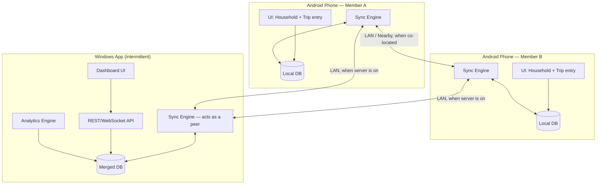

# System Overview

## Actors

- **Household members** (2+ people) — each carries an Android phone with the app installed. This is the primary way expenses get entered.
- **The server operator** (you) — runs the Windows app on a personal machine, intermittently. It is not a cloud service; it has no guaranteed uptime.

## The core constraint that shapes everything

The Windows server is **not always on**. If sync depended on the server being reachable, two people on the same trip or in the same house could go days without seeing each other's expenses. So the server cannot be the only source of truth in the sync topology — it is one participant among several, not a hub everything else depends on.

This pushes the whole system towards an **offline-first, local-first architecture**: every Android device holds a complete, independently useful copy of the data it's aware of, and devices reconcile with each other opportunistically (phone-to-phone) as well as with the server whenever it happens to be reachable. The server is a durable, always-correct peer that also happens to render dashboards — not a database the phones "call."

## Two independent expense domains

These are structurally similar (money, category, payer, date, notes) but semantically separate and must not be mixed in reporting or budgets:

1. **Household expenses** — recurring, monthly-budgeted, shared indefinitely by the household members.
2. **Trip / event expenses** — bounded in time, has its own budget, has its own participant list (may be a subset of the household, or include people outside it entirely, similar to Splitwise), and settles independently (who owes whom at the end).

Both domains share the same sync engine and device pairing, but are modeled as separate entity families (see [02-data-model.md](02-data-model.md)).

## Component diagram

## Sync topology: gossip over a small mesh

Because a household has a small, fixed set of devices (typically 2-5), a full peer-to-peer gossip protocol is tractable without any cloud infrastructure:

- Any two devices that can see each other on the same LAN (or via Wi-Fi Direct / Nearby Connections when not on the same network) can sync directly.
- The server is just another peer in this mesh — it doesn't need to be online for phones to sync with each other, and phones don't need to be near each other if they've each separately synced with the server at different times ("store and forward" via the server).
- Because sync is append-only and idempotent (see [03-sync-protocol.md](03-sync-protocol.md)), it doesn't matter which order or path data travels through the mesh — the end state converges regardless.

## Why not "server is the source of truth, phones are thin clients"

That's the more conventional design, and it's simpler — but it breaks the explicit requirement that the server can be off for extended periods while members keep entering and seeing each other's expenses. A thin-client design would mean whoever's phone doesn't have the server reachable is flying blind until the next server session. The offline-first/mesh design costs more upfront complexity (a real sync protocol, see next doc) but is the only shape that satisfies the stated use case.

## Windows app's actual job

Because the sync engine already keeps a fully-merged copy of all data on the server whenever it runs, the Windows app's distinctive value is not "holding the data" but:
- **Analytics & dashboards** — category breakdowns, budget burn-down, trend detection, spending suggestions.
- **A convenient desktop entry point** for expenses (typed on a keyboard instead of a phone).
- Acting as the most reliable **relay** in the mesh, since it's the device most likely to have been recently in contact with every household member's phone.
