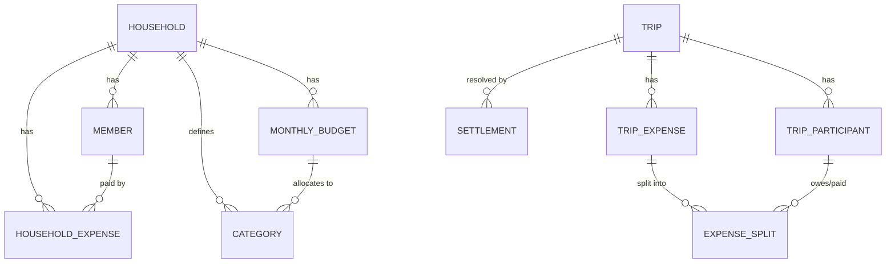

# Data Model

## Design principle: event log, not mutable rows

Every device's local database is really a **materialized view over an append-only operation log**. Instead of "update row X", a device writes an immutable `Operation` record; the current state of any entity is computed by folding its operations in causal order. This is what makes the mesh-sync in [03-sync-protocol.md](03-sync-protocol.md) possible: operations can be exchanged in any order, replayed idempotently, and merged deterministically, because nothing is ever mutated in place.

This does **not** mean the UI queries the log directly — each device also keeps normal indexed tables (the "materialized view") for fast reads; the log is the sync/merge substrate underneath.

## Household domain

| Entity | Key fields | Notes |
|---|---|---|
| `Household` | id, name, created_at | One per family/house. Devices are provisioned into exactly one household (v1). |
| `Member` | id, household_id, display_name, device_id | A person. `device_id` links to the physical phone that syncs on their behalf. |
| `Category` | id, household_id, name, icon, is_archived | e.g. Groceries, Utilities, Rent, Eating Out. Household-defined, editable. |
| `MonthlyBudget` | id, household_id, year, month, total_amount, per_category_allocation (map category_id → amount, optional) | Entered at start of month by any member; if per-category isn't specified, only the total is tracked. |
| `HouseholdExpense` | id, household_id, category_id, amount, currency, paid_by_member_id, occurred_at, note, created_by_device_id, created_at | The core record. `occurred_at` (when the spend happened) is distinct from `created_at` (when it was logged), since entries may be back-dated. |

### Weekly budget is derived, not stored

Only `MonthlyBudget.total_amount` is ever entered/synced. The weekly breakdown and spend-vs-budget alerting are **computed locally on read**, the same "derive, don't duplicate" rule used for trip balances (see [below](#why-balances-are-derived-not-stored)):

- The month is partitioned into weeks (policy: calendar weeks, Mon–Sun; the first/last week of a month is usually partial). Each week's allocation = `total_amount × (days of that week falling inside this month ÷ days in month)`. This means a 4-day partial week at the month's edge gets a proportionally smaller slice rather than a full week's share.
- "Spent this week" = sum of `HouseholdExpense.amount` where `occurred_at` falls in that week (household-wide, or per-category if `per_category_allocation` is set — same day-proportional split applied per category).
- This is pure derivation over already-synced data, so it requires **no new sync entity** and no protocol changes — every device (including one that's been offline) computes the identical week boundaries and spend totals from the operation log it already has.
- Rationale for computing rather than storing "WeeklyBudget" rows: storing them would just reintroduce the redundant-mutable-state problem balances already avoid — the week's spend total changes on every new expense, and we don't want yet another field two devices could race to update.

## Trip / event domain (Splitwise-like)

| Entity | Key fields | Notes |
|---|---|---|
| `Trip` | id, name, start_date, end_date (nullable while ongoing), budget_amount, currency, created_by, is_closed | Independent of household budget entirely. |
| `TripParticipant` | id, trip_id, display_name, member_id (nullable) | Nullable `member_id` allows including a guest who has no household account/app — an important Splitwise-parity detail. |
| `TripExpense` | id, trip_id, category_id (optional, trip-scoped categories), amount, currency, paid_by_participant_id, occurred_at, note | |
| `ExpenseSplit` | id, trip_expense_id, participant_id, share_amount OR share_percent OR share_weight | Supports equal split, exact amounts, percentage, or weighted (shares) — same flexibility as Splitwise. |
| `Settlement` | id, trip_id, from_participant_id, to_participant_id, amount, settled_at, note | Records an actual payment made to close a balance; **not** an expense. Balance-owed is always *derived* (sum of splits minus sum of settlements), never stored redundantly. |

## Sync substrate (underlies both domains)

| Entity | Fields | Notes |
|---|---|---|
| `Operation` | op_id (UUID, globally unique), entity_type, entity_id, op_type (create/update/delete), payload (JSON), author_device_id, hlc (hybrid logical clock), received_from (audit trail of relay path, optional) | The unit of sync. Immutable once created. |
| `Device` | device_id (UUID), household_id, owner_member_id, last_seen_hlc, public_key (for pairing/auth) | Identity for every phone + the server itself (server is also a "device" in the mesh). |

### Field-level conflict resolution

Each `Operation` for an `update` carries only the changed fields (a patch), not a full row replace. When two devices concurrently edit different fields of the same expense (rare, but possible — e.g., one fixes the amount while another fixes the category), both patches apply cleanly. When they touch the *same* field concurrently, **last-write-wins by HLC timestamp**, with `device_id` as a deterministic tiebreaker on exact ties. This is simple to reason about and sufficient here — expenses are typically written once and rarely contested-edited, so we deliberately avoid a heavier CRDT (e.g. multi-value registers) for v1.

### Deletes

Deletes are tombstone operations (`op_type = delete`), never physical row removal from the log, so a delete that arrives after other devices have already synced the create still converges correctly instead of resurrecting the row.

## Why balances are derived, not stored

For trips, `amount_owed` between any two participants is always computed from `ExpenseSplit` and `Settlement` records at read time (or cached and invalidated), never written as its own mutable field. This avoids an entire class of sync conflicts where two devices would otherwise both try to "own" the current balance.
