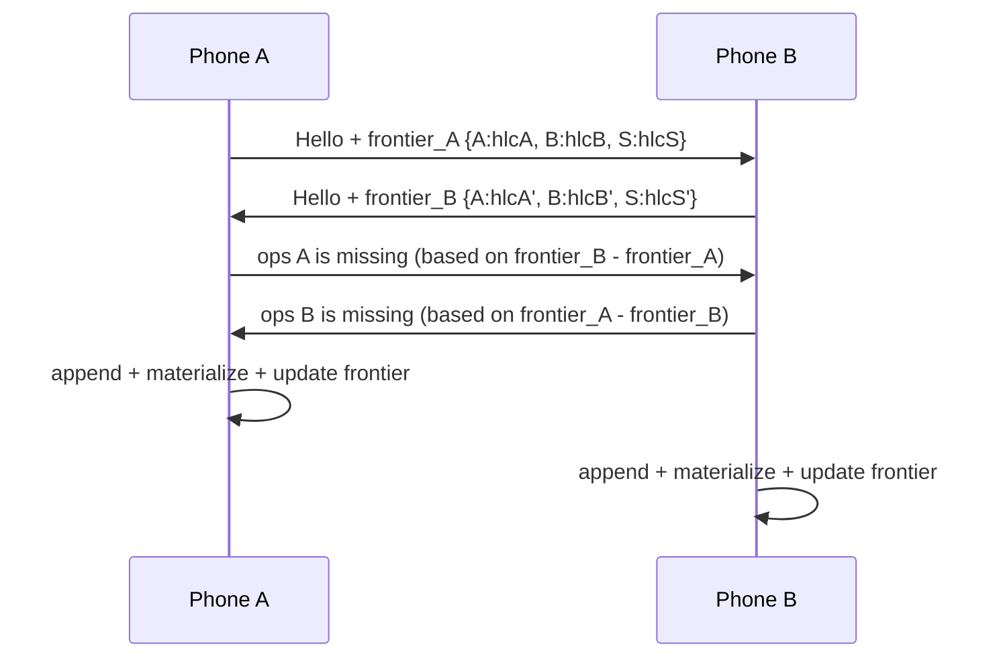

# Sync Protocol

## Goals

- Two devices that come into contact (LAN, Nearby, or via the server as relay) converge to the same state regardless of order, without a central authority being online.
- Safe to interrupt at any point (phone walks out of Wi-Fi range mid-sync) — must be resumable, never leave data in a partial/corrupt state.
- Cheap on a phone — small deltas, not full-database transfers, after the first sync.

## Identity & clocks

- Every device (each phone, and the server itself) has a stable UUID (`device_id`), generated at pairing time.
- Every device maintains a **Hybrid Logical Clock (HLC)**: `(physical_time_ms, logical_counter)`. HLCs give a total order over operations across devices without requiring synchronized clocks, and they stay close to wall-clock time for human-readable "when did this happen" ordering.

## Discovery

1. **Same LAN** — Android Network Service Discovery (NSD/mDNS) advertises `_expensetracker._tcp` on the local network; any device on the same Wi-Fi (home network, or a shared trip hotspot) finds peers automatically.
2. **No shared LAN** — Android Nearby Connections API (Bluetooth/Wi-Fi Direct hybrid) as a fallback for "two phones in the same room, no common Wi-Fi" (e.g., mid-trip, hotel Wi-Fi with client isolation).
3. **Server** — the Windows app, when running, advertises the same way; phones treat it as just another peer, not a special endpoint.

*(Out of scope for v1, noted for later: a cloud relay for members not co-located and without the server on — e.g., a small hosted queue. The protocol below is designed so this can be added later as "just another peer reachable over the internet" without changing the merge logic.)*

## Pairing / trust

- One device (whoever sets up the household) generates a household key pair and a **join code / QR**.
- New devices scan the QR to receive the household's shared symmetric key, register their own `device_id` + public key, and are added to the `Device` table via a normal `create Operation` — pairing is itself just sync data.
- All sync traffic between devices is encrypted with the household's pre-shared key (LAN traffic isn't otherwise trusted). This is deliberately simple (no PKI, no cloud identity provider) since the trust boundary is "people who share a house/trip and were physically handed a QR code."

## Sync session (what happens when two devices meet)

1. **Handshake** — exchange `device_id`s and each side's *sync frontier*: for every other device it knows about, the highest HLC it has already incorporated from that device. This is a compact vector (`{device_id: max_hlc}`), not a full log listing.
2. **Diff** — each side computes which operations the other is missing by comparing frontiers, and requests them.
3. **Transfer** — missing `Operation` records stream over (in HLC order per originating device). Batched/paged so a sync can be resumed if interrupted (resume point = last frontier successfully persisted).
4. **Apply** — receiving side appends new operations to its local log, then re-materializes only the affected entities' read-optimized rows (not a full rebuild).
5. **Frontier update** — both sides persist the new frontier only after operations are durably written, so a crash mid-sync just means "sync again," never data loss or duplication (operations are applied idempotently by `op_id`).

## Gossip propagation (why full mesh connectivity isn't required)

Devices don't all need to see each other directly. If Phone A syncs with the Server on Monday, and Phone B syncs with the Server on Wednesday, B transitively receives everything A wrote, and the Server receives everything B wrote (which A will pick up next time it connects to the Server, or directly to B). Each device's frontier vector already tracks every *other* device it has ever heard about (transitively), not just devices it has directly met — so the diff step in step 2 above correctly requests operations that originated anywhere in the mesh, relayed through whoever it's currently talking to.

## Conflict resolution recap

See [02-data-model.md](02-data-model.md#field-level-conflict-resolution) — field-level last-write-wins by HLC, deletes as tombstones, balances always derived rather than synced as mutable state.

## Failure modes considered

| Scenario | Behavior |
|---|---|
| Server never turns on for a week | Phones still sync with each other directly whenever co-located; only the dashboard/analytics view is stale, not the underlying data. |
| Phone loses connection mid-transfer | Resumes from last durably-applied frontier; no duplicate or lost operations (idempotent by `op_id`). |
| Two members edit the same expense's amount at the same moment on different phones | Both operations are logged; whichever has the later HLC wins for that field once the two phones sync; no crash, no silent data loss (losing write is still in the log for audit/undo). |
| A phone is offline for months then returns | Its frontier is far behind; next sync just transfers a larger backlog — same protocol, no special case. |
| New device joins mid-trip | Pairs via QR, gets the full relevant operation log (household + any trips it's added to) on first sync — same protocol as any catch-up. |
