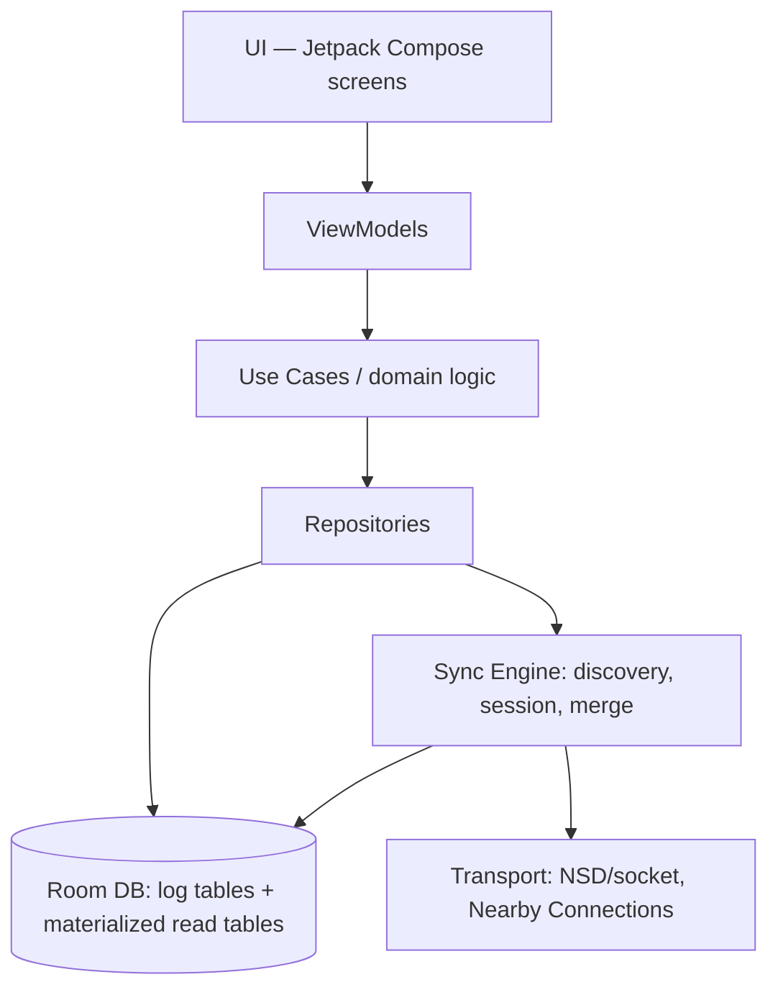

# Android App Architecture

## Layering

- **UI (Compose)**: two top-level feature areas — Household and Trips — plus a shared Settings/Devices screen (pairing, household members).
- **ViewModels**: one per screen, expose state flows; no business logic beyond presentation formatting.
- **Use cases**: e.g. `RecordHouseholdExpense`, `CreateTrip`, `AddTripExpenseWithSplit`, `SettleUp`. This is where domain rules live (e.g., split amounts must sum to the expense total).
- **Repositories**: the only thing that touches Room. Translate between domain models and the log/materialized tables described in [02-data-model.md](02-data-model.md).
- **Sync Engine**: a background component (not tied to any screen) that runs the protocol in [03-sync-protocol.md](03-sync-protocol.md). Triggered by (a) NSD peer-found callback, (b) periodic WorkManager job as a fallback, (c) manual "sync now" button for user-initiated confidence.

## Module structure

To maximize reuse with the Windows server (see [06-tech-stack.md](06-tech-stack.md) for the Kotlin Multiplatform decision), split into:

- `core-model` (KMP, no Android deps) — entities, operation log types, HLC.
- `core-sync` (KMP) — sync protocol logic, transport-agnostic (defines a `Transport` interface; Android implements it over NSD/Nearby, server implements it over plain sockets).
- `core-domain` (KMP) — use cases, validation rules (split math, budget math).
- `android-app` — Compose UI, Room (Android-only persistence), platform transport implementations, WorkManager scheduling.

This means the trickiest, highest-risk part of the whole system — the sync/merge logic — is written and tested **once** and shared verbatim between phone and server, rather than reimplemented in Kotlin on Android and something else on Windows.

## Offline-first by construction

Every write from the UI goes: UI → use case → repository → **local Room write** (log + materialized tables), full stop. The Sync Engine is not in the write path — it only reads the log to find operations to send out, and writes incoming operations from peers. This means the app is 100% functional with zero connectivity; sync is purely an eventually-arriving side effect.

## Background sync triggers

1. NSD service found → attempt sync session automatically (silent, no user action).
2. WorkManager periodic job (~every 15–30 min while app is in foreground/recently used) as a safety net for missed NSD callbacks.
3. Explicit pull-to-refresh / "Sync now" affordance for user confidence, especially useful right when arriving at the house or meeting up on a trip.

## Two feature areas, one engine

Household and Trip screens are separate Compose feature modules with separate ViewModels/use cases, but both go through the same repository/sync stack — a trip expense and a household expense are different entity types in the same operation log, synced by the same mechanism, with no special-casing in the sync engine itself.

## Budget alerting (weekly for household, overall for trips)

This is purely a **read-side, local computation** — it needs no new synced entity (see [02-data-model.md](02-data-model.md#weekly-budget-is-derived-not-stored)) and must work fully offline, since it's meant to warn a member the moment they're about to overspend, not after the next sync.

- Lives in `core-domain` as a use case (e.g. `BudgetStatus`/`EvaluateBudgetThreshold`) so the exact same threshold logic runs on Android and on the Windows dashboard — one place to get the "almost over" definition right.
- **Household**: recomputed after every `HouseholdExpense` write (and on screen load), against the current calendar week's derived allocation. Two thresholds, configurable but defaulting to: **nearing** (≥ 80% of the week's allocation) and **over** (≥ 100%).
- **Trip**: same use case, but evaluated against the trip's single overall `budget_amount` rather than a weekly slice — no weekly partition applies to trips, since they're bounded events, not recurring monthly cycles.
- **Overspending is never blocked.** The use case only ever returns a status (`ok` / `nearing` / `over`) plus the amount over/under — recording an expense is unconditionally allowed regardless of status, per the requirement that the app track reality rather than gate it.
- **UI treatment**: the "nearing" status surfaces as a warning banner/badge on the relevant screen (household weekly summary, or trip summary); the "over" status renders the budget figure and the responsible progress bar/amount **in red**, both on the entry confirmation and on the summary screens, so overspending is visually obvious without ever being prevented.
- A local notification (Android `Notification`, no sync/network involved) fires the moment a write pushes status from `ok`/`nearing` into `nearing`/`over`, so the alert is immediate even if the app isn't open at the time of a background-triggered recompute — in practice this mostly fires right after the triggering expense is entered, since that's the only time status can change.
- Because this is derived from data already local to the device, a phone that's been offline for weeks still alerts correctly the instant an expense is entered — it doesn't need the server or other phones to be reachable to know it's near/over budget.
