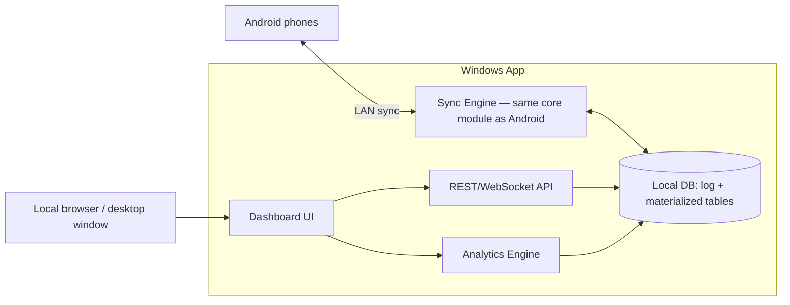

# Windows Server Architecture

## Role recap

The Windows app is a peer in the sync mesh (same `core-sync`/`core-model` code as Android, see [06-tech-stack.md](06-tech-stack.md)) plus three things a phone doesn't need to do: serve a richer dashboard, run analytics, and act as the most reliable relay point in the household.

## Runtime shape

Runs as a **local background process with a system tray icon** (start on login, optional), not a Windows Service — this matches "personal machine, turned on/off casually" rather than "always-managed infrastructure." When running:
- Sync engine advertises on the LAN and accepts sync sessions from any paired phone.
- API server listens on localhost + LAN (e.g., `http://<pc-ip>:PORT`) so the dashboard is reachable from other devices on the home network too (e.g., viewing analytics from a phone browser), not just the PC itself.

## API layer

A small REST + WebSocket API (Ktor, see tech stack doc) in front of the local DB:
- REST for dashboard queries (budget vs. actual, category breakdowns, trip balances).
- WebSocket for pushing "data changed" notifications to an open dashboard so it updates live while sync happens in the background, without polling.
- The API is a read/write facade over the same repository layer used by sync — expenses entered directly on the Windows app go through the identical use-case → operation-log path as an Android entry, so they sync back out to phones exactly the same way.

## Analytics Engine

Operates purely on the merged local DB (already-materialized tables), recomputed on demand or on data-changed events:

- **Budget tracking**: monthly total spent vs. `MonthlyBudget.total_amount`, per-category burn-down, days-remaining-in-month vs. percent-budget-used pace indicator, plus the **weekly breakdown and nearing/over status** using the same derivation and thresholds as the phone (see [04-android-app-architecture.md](04-android-app-architecture.md#budget-alerting-weekly-for-household-overall-for-trips)) — weeks/categories over threshold render in red on the dashboard exactly as they do on the phone, and overspending is displayed, never blocked, here either.
- **Category breakdowns**: household expenses grouped by category, over selectable time windows (this month, last 3 months, year).
- **Trends**: month-over-month deltas per category, flagging categories that grew significantly.
- **Trip settlement view**: per-trip balance sheet (who owes whom, minimal transaction settlement suggestion — classic Splitwise "simplify debts" algorithm), including the trip's nearing/over overall-budget status.
- **Suggestions (v1, rule-based)**: e.g. "Eating Out is 40% over its 3-month average," "You're on pace to exceed this month's budget by ~₹X at the current daily rate." Deliberately rule-based first; this is a natural place to layer in a smarter/ML-based suggestion engine later without touching the sync or data layers.

## Dashboard UI

Renders the analytics via the API. Two reasonable options (decided in [06-tech-stack.md](06-tech-stack.md)):
- A local web dashboard (server serves HTML/JS, viewed in any browser on the LAN — works from the PC or a phone browser).
- A native desktop window (Compose Multiplatform Desktop) if a truly native feel matters more than cross-device browser access.

## Why the server also needs the full sync engine (not a simplified "receive-only" version)

If the server only *received* data but never helped *propagate* it, two phones that only ever meet each other through the server (never directly) wouldn't converge — Phone A's data would sit on the server without ever reaching Phone B unless the server actively re-gossips what it collected. Running the identical `core-sync` module (not a special server-only variant) guarantees this relay behavior is correct by construction, since it's the same merge/frontier logic doing the same thing on every node in the mesh.
