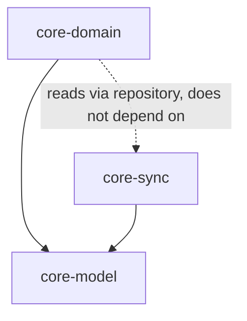
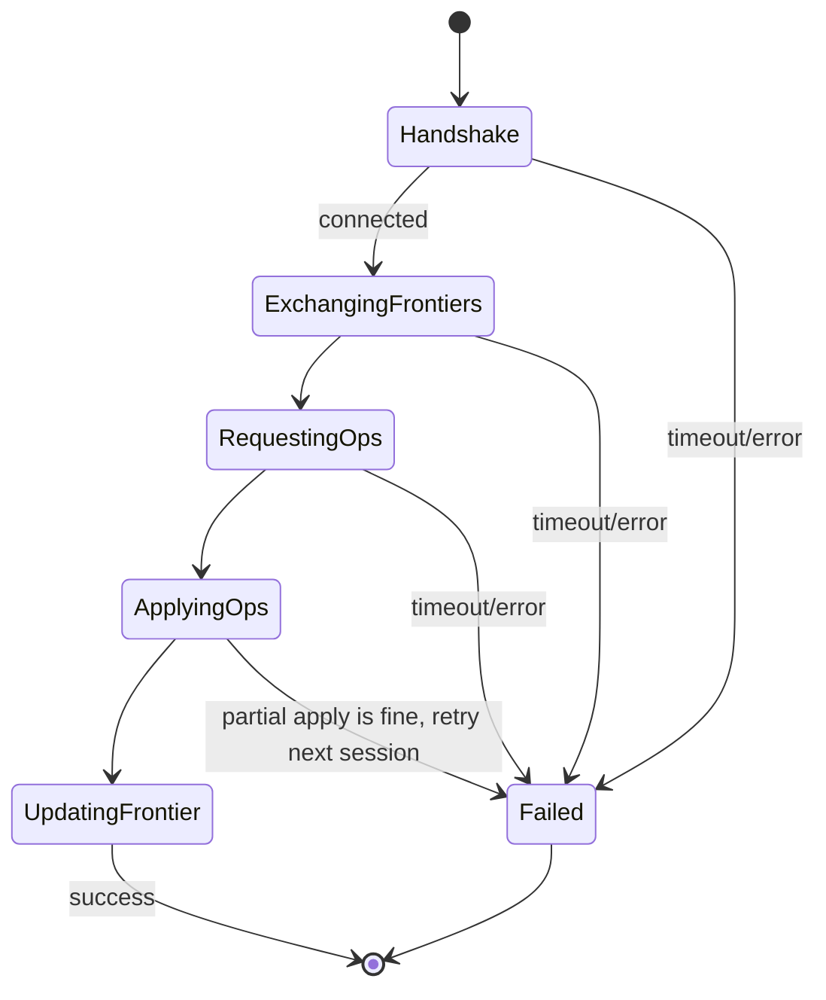

# Core Logic — Design

Covers the shared Kotlin Multiplatform modules used by both apps:
`core-model`, `core-sync`, `core-domain` (named in
[Arch/06-tech-stack.md](../Arch/06-tech-stack.md)). This is the one part of
the system that must behave *identically* on Android and Windows, so it's
designed once here rather than per-platform.

## Module boundaries



- **`core-model`** — entities, the operation log record shape, HLC. No I/O,
  no coroutines even where avoidable. Pure data + pure functions.
- **`core-sync`** — the sync protocol from
  [Arch/03-sync-protocol.md](../Arch/03-sync-protocol.md): frontier
  computation, session state machine, conflict resolution, pairing/crypto.
  Depends on `core-model`. Defines `Transport` and `OperationStore` as
  interfaces implemented per platform — `core-sync` itself never touches a
  socket or a database directly.
- **`core-domain`** — use cases: recording expenses, computing splits,
  weekly budget derivation, threshold/alerting evaluation, debt
  simplification. Depends on `core-model` and a `Repository` interface (not
  on `core-sync` directly — domain code shouldn't need to know sync exists).

Each platform app provides the concrete `Transport`, `OperationStore`, and
`Repository` implementations and wires the three modules together.

## `core-model`

### Entities

Kotlin `data class` per entity in
[Arch/02-data-model.md](../Arch/02-data-model.md#household-domain):
`Household`, `Member`, `Category`, `MonthlyBudget`, `HouseholdExpense`,
`Trip`, `TripParticipant`, `TripExpense`, `ExpenseSplit`, `Settlement`,
`Device`. All IDs are `String` (UUIDv4). Money is represented as a `Long`
minor-unit integer (paise/cents) plus a `String` ISO 4217 currency code —
never floating point, to keep sync-merged sums exact.

### `Operation`

```kotlin
data class Operation(
    val opId: String,          // UUID, globally unique, dedup key
    val entityType: EntityType, // enum: HOUSEHOLD_EXPENSE, TRIP_EXPENSE, ...
    val entityId: String,
    val opType: OpType,         // CREATE, UPDATE, DELETE
    val patch: Map<String, JsonElement>, // changed fields only, for UPDATE
    val authorDeviceId: String,
    val hlc: Hlc,
    val receivedFrom: String? = null, // last relay hop, audit only
)
```

`patch` uses `kotlinx.serialization`'s `JsonElement` so the log format is
storage-agnostic and forward-compatible (unknown fields from a newer app
version are preserved and re-transmitted even if this version doesn't
understand them — important since phones and the server won't always be on
the same app version).

### Hybrid Logical Clock

```kotlin
data class Hlc(val physical: Long, val counter: Int, val deviceId: String) :
    Comparable<Hlc> {
    override fun compareTo(other: Hlc): Int = compareValuesBy(
        this, other, Hlc::physical, Hlc::counter, Hlc::deviceId,
    )
}

class HlcClock(private val deviceId: String) {
    private var last = Hlc(0, 0, deviceId)
    fun tick(): Hlc { /* local event: advance vs wall clock + last */ }
    fun receive(remote: Hlc): Hlc { /* merge on incoming operation */ }
}
```

Standard HLC algorithm (Kulkarni et al.): `tick()` takes
`max(wallClockNow, last.physical)`, bumping the counter only when the
physical time didn't advance; `receive()` additionally folds in the remote
timestamp so causality across devices is preserved. `deviceId` is the final
tiebreaker for `compareTo`, giving a total order with no ties.

## `core-sync`

### Interfaces the platform must implement

```kotlin
interface OperationStore {
    suspend fun append(ops: List<Operation>)          // idempotent by opId
    suspend fun opsSince(frontier: Map<String, Hlc>): List<Operation>
    suspend fun localFrontier(): Map<String, Hlc>      // per-device max hlc seen
}

interface Transport {
    fun advertise(deviceId: String)                    // start being discoverable
    fun discover(): Flow<PeerHandle>                    // peers found over time
    suspend fun connect(peer: PeerHandle): SyncChannel   // bidirectional byte stream
}

interface SyncChannel {
    suspend fun send(bytes: ByteArray)
    suspend fun receive(): ByteArray
    suspend fun close()
}
```

`core-sync` never imports Android or JVM-specific APIs — it only calls
these three interfaces, so the identical session/merge/gossip logic runs on
both platforms (see [Arch/06-tech-stack.md](../Arch/06-tech-stack.md#what-this-buys-concretely)
for why that matters).

### Session state machine



Wire messages (all length-prefixed, `kotlinx.serialization` CBOR for
compactness over LAN/Bluetooth):

| Message | Direction | Payload |
|---|---|---|
| `Hello` | both | `deviceId`, protocol version, household id |
| `Frontier` | both | `Map<deviceId, Hlc>` |
| `OpsRequest` | both | `Map<deviceId, Hlc>` (what the sender needs, computed from the peer's frontier) |
| `OpsBatch` | both | `List<Operation>`, paged (e.g. 500 ops/message) so large first-syncs are resumable |
| `Ack` | both | last `opId` durably applied, so a dropped connection mid-batch resumes correctly |

Every message after `Hello` is per-direction and independent — both sides
push and pull in the same session (no separate "client"/"server" role
between two peers; symmetric, matching the mesh topology).

### Conflict resolution (implementation of the Arch rule)

`core-sync` folds operations into a "current state" map per entity by:
1. Grouping applicable operations for an entity by `entityId`.
2. Sorting by `Hlc`.
3. For `CREATE`: first one wins as the base row (should be unique in
   practice; if two devices independently create the same `entityId`
   that's a bug elsewhere, not a sync concern — IDs are generated
   client-side as UUIDs specifically to make collisions practically
   impossible).
4. For `UPDATE`: apply patches to the base row in `Hlc` order, per-field —
   a later patch's field values overwrite earlier ones for the *same* key
   only.
5. For `DELETE`: once seen, the entity is a tombstone regardless of
   `Hlc` order of arrival (a delete always wins over any concurrent
   update, since resurrecting a user-deleted row is worse than losing an
   edit — documented tradeoff).

### Pairing & crypto

- Household creator generates an X25519 keypair; the household symmetric
  key is a random 256-bit key, generated once, wrapped for each new device
  during pairing.
- QR payload (JSON, then base64): `{ "householdId", "wrappedKey" (sealed
  box to the new device's ephemeral pairing pubkey shown as a second,
  short-lived QR/manual code the new device displays), "bootstrapPeer" (IP
  hint if on same LAN, optional) }`. Two-step pairing (new device shows its
  pubkey first, existing device scans it, then shows the wrapped-key QR)
  avoids ever transmitting the raw household key unencrypted, even locally.
- All `SyncChannel` bytes are wrapped in AES-256-GCM using the household
  key, with a random nonce per message; this is independent of whatever
  transport-level security the LAN/Bluetooth link may or may not have.
- Implemented as a small `Crypto` object in `core-sync` (platform-agnostic;
  `kotlinx-crypto` or a small pure-Kotlin AES-GCM implementation — see
  [Implementation doc](../Implementation/01-core-logic-implementation.md)
  for the concrete library choice).

## `core-domain`

### Weekly budget derivation

```kotlin
fun weekAllocation(monthlyBudget: MonthlyBudget, week: DateRange): Long {
    val monthDays = daysInMonth(monthlyBudget.year, monthlyBudget.month)
    val overlapDays = week.overlapDaysWith(monthlyBudget.monthRange())
    return monthlyBudget.totalAmount * overlapDays / monthDays
}
```

Weeks are Mon–Sun (`java.time`/`kotlinx-datetime` `DayOfWeek.MONDAY` as
anchor). `overlapDaysWith` handles partial weeks at month boundaries as
described in [Arch/02-data-model.md](../Arch/02-data-model.md#weekly-budget-is-derived-not-stored).

### Budget status evaluation

```kotlin
enum class BudgetStatus { OK, NEARING, OVER }

data class BudgetEvaluation(
    val status: BudgetStatus,
    val allocated: Long,
    val spent: Long,
    val remainingOrOver: Long, // negative when OVER
)

fun evaluateBudget(
    allocated: Long,
    spent: Long,
    nearingThreshold: Double = 0.8,
): BudgetEvaluation {
    val status = when {
        spent >= allocated -> BudgetStatus.OVER
        spent >= allocated * nearingThreshold -> BudgetStatus.NEARING
        else -> BudgetStatus.OK
    }
    return BudgetEvaluation(status, allocated, spent, allocated - spent)
}
```

Same function serves both household-weekly (`allocated` =
`weekAllocation(...)`) and trip-overall (`allocated` = `trip.budgetAmount`)
call sites — the caller decides what "allocated" and "spent" mean; the
threshold/highlight logic itself doesn't know or care which domain it's
evaluating, per [Arch/04-android-app-architecture.md](../Arch/04-android-app-architecture.md#budget-alerting-weekly-for-household-overall-for-trips).
`nearingThreshold` defaults to 80% but is a parameter, not a constant, so a
future per-household setting doesn't require touching this function.

### Trip settlement (debt simplification)

Standard greedy algorithm, same one Splitwise uses conceptually:
1. Compute each participant's net balance = `sum(paid as payer across
   splits)` − `sum(owed across splits)` − `sum(settlements sent)` +
   `sum(settlements received)`.
2. Split participants into creditors (positive net) and debtors (negative
   net), each as a max-heap.
3. Repeatedly match the largest creditor with the largest debtor, settle
   the smaller of the two amounts, push remainder back onto the heap,
   until all balances are ~0.
4. Output: a minimal list of suggested `{from, to, amount}` transfers — a
   *suggestion* for the settle-up screen, not a `Settlement` record itself
   (those are only created once a member confirms a real payment happened).

### Split validation

`AddTripExpenseWithSplit` use case validates, before producing an
`Operation`:
- Equal split: divides evenly, remainder (from integer division) assigned
  to the first participant deterministically (avoids fractional-currency
  drift).
- Exact-amount split: sum of `share_amount` must equal the expense total
  exactly, or the use case rejects it.
- Percentage split: sum of `share_percent` must equal 100 (within a small
  epsilon), converted to amounts at save time, same remainder rule as
  equal split.
- Weighted split: amounts computed proportional to `share_weight`, same
  remainder rule.

## Testing hooks

`core-sync` ships an in-memory `FakeTransport` + `FakeOperationStore` pair
specifically so `core-sync`'s own test suite (see
[Test/](../Test/README.md)) can spin up 3+ simulated peers in a single JVM
test process and assert convergence, gossip propagation through an
intermediary, and interrupted-sync resumption — without needing a real
phone, a real server, or real network hardware. This is the same reasoning
as [Arch/06-tech-stack.md](../Arch/06-tech-stack.md#what-this-buys-concretely):
one implementation, one place to prove it correct.
