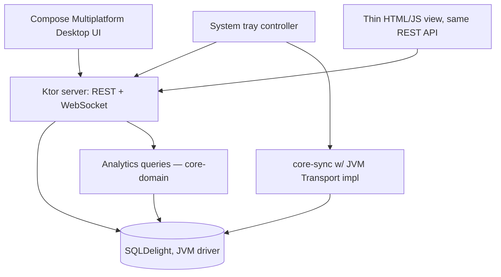

# Windows App — Design

Covers the desktop server/dashboard app described in
[Arch/05-windows-server-architecture.md](../Arch/05-windows-server-architecture.md).
Built on the `core-model` / `core-sync` / `core-domain` modules from
[01-core-logic-design.md](01-core-logic-design.md); this doc only covers
what's specific to the Windows app.

## Component layout

## Platform `Transport` implementation

- **Discovery**: JmDNS advertises/browses `_expensetracker._tcp.local.`,
  matching the Android NSD side of the same protocol.
- **Channel**: plain TCP socket on a fixed configurable port (default
  `47321`), one connection per sync session, framed with a 4-byte
  length-prefix per message (matches [01-core-logic-design.md](01-core-logic-design.md#session-state-machine)
  wire messages).
- **`OperationStore`**: SQLDelight-backed; `append` does an
  `INSERT OR IGNORE` keyed on `opId` (idempotency for free at the DB
  layer), `opsSince` is an indexed query on `(author_device_id, hlc)`.

## REST API

Base path `/api/v1`. All mutating endpoints go through the same
`core-domain` use cases the Android app calls locally — the API is a thin
HTTP wrapper, not a parallel business-logic path.

| Method | Path | Purpose |
|---|---|---|
| `GET` | `/household` | Household + members + categories |
| `GET` | `/budgets/{year}/{month}` | Monthly budget + derived weekly breakdown + status |
| `POST` | `/budgets` | Set/update a monthly budget |
| `GET` | `/expenses?from=&to=&category=` | Household expenses, filtered |
| `POST` | `/expenses` | Record a household expense |
| `GET` | `/trips` | List trips (open + closed) |
| `POST` | `/trips` | Create a trip |
| `GET` | `/trips/{id}` | Trip detail: participants, expenses, balances, status |
| `POST` | `/trips/{id}/expenses` | Record a trip expense + split |
| `POST` | `/trips/{id}/settlements` | Record a real settle-up payment |
| `GET` | `/analytics/categories?window=` | Category breakdown for a time window |
| `GET` | `/analytics/trends` | Month-over-month deltas |
| `GET` | `/analytics/suggestions` | Rule-based spending suggestions |
| `GET` | `/devices` | Paired devices list |
| `POST` | `/devices/pairing/start` | Begin a new-device pairing flow, returns QR payload |
| `WS` | `/ws/changes` | Push notification whenever any entity changes (sync-applied or local write) |

Every `POST` returns the resulting entity plus its `BudgetEvaluation` where
relevant (e.g. `POST /expenses` returns the new expense *and* the updated
weekly status), so the dashboard can update its red/nearing highlighting
without a second round-trip.

## Desktop UI (Compose Multiplatform Desktop)

Screens:
- **Household Dashboard** — this month's total vs. budget, current week's
  status banner/progress bar (red when `OVER`, amber when `NEARING`),
  category breakdown chart, recent expenses list, quick "Add expense"
  entry.
- **Trips** — list of open/closed trips with at-a-glance status; opening
  one shows participants, expense list, running balances, and a
  "Settle Up" panel showing the simplified-debt suggestions from
  [01-core-logic-design.md](01-core-logic-design.md#trip-settlement-debt-simplification).
- **Analytics** — trends over time, suggestions list.
- **Devices** — paired devices, "Add a device" (renders the pairing QR),
  last-synced time per device (from `Device.last_seen_hlc`, human-readable
  as "synced 2 hours ago").
- **Settings** — port number, start-on-login toggle, currency, weekly
  nearing-threshold override (defaults to 80%, see
  [01-core-logic-design.md](01-core-logic-design.md#budget-status-evaluation)).

All screens read exclusively through the REST/WebSocket API layer, not
directly against the DB — this keeps the desktop UI and the thin web view
genuinely interchangeable/consistent, and means the UI layer has zero
sync-specific code to get wrong.

## Thin web view

A single static HTML/JS bundle served by Ktor at `/`, hitting the same
`/api/v1/*` endpoints and the WebSocket for live updates. Deliberately not
a second implementation of the dashboard — same data, simpler layout,
useful for checking analytics from a phone browser on the home network
without opening the Android app.

## System tray / lifecycle

- Tray icon (Java AWT `SystemTray`) with menu: "Open Dashboard", "Sync Now",
  "Start on login" toggle, "Quit".
- On start: load config (port, household key path), start Ktor, start
  `core-sync` advertising/discovery, open the main window (or stay
  minimized to tray if launched via start-on-login).
- On quit: graceful shutdown — finish any in-flight sync session before
  closing sockets, so a quit mid-sync doesn't leave a peer's frontier
  update half-applied (sessions are already resumable per
  [01-core-logic-design.md](01-core-logic-design.md#session-state-machine), but a clean stop is nicer than relying on that).

## Config & storage

- Config file: `%APPDATA%/ExpenseTracker/config.json` (port, household id,
  start-on-login flag, nearing threshold overrides).
- Household key: `%APPDATA%/ExpenseTracker/household.key` (wrapped, not
  plaintext — see [01-core-logic-design.md](01-core-logic-design.md#pairing--crypto)).
- DB file: `%APPDATA%/ExpenseTracker/data.db` (SQLDelight/SQLite, single
  file, trivially backed up by copying it while the app is stopped).
