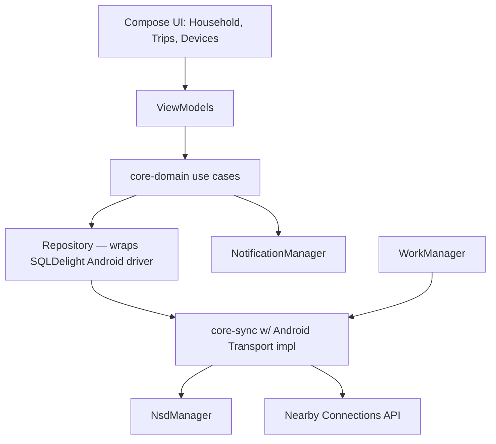
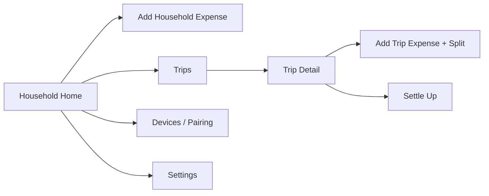

# Android App — Design

Covers the phone client described in
[Arch/04-android-app-architecture.md](../Arch/04-android-app-architecture.md).
Built on `core-model` / `core-sync` / `core-domain` from
[01-core-logic-design.md](01-core-logic-design.md); this doc only covers
what's specific to Android. Note: this subsystem is being designed second,
after the Windows app, per the sequencing decision to validate the shared
core on desktop first (faster iteration, easy multi-peer simulation)
before building the mobile-specific transport and UI.

## Component layout

## Platform `Transport` implementation

- **Primary (same LAN)**: `NsdManager` advertises/discovers
  `_expensetracker._tcp`, then opens a plain `Socket`/`ServerSocket` on a
  fixed port — same wire protocol and framing as the Windows JVM transport
  in [02-windows-app-design.md](02-windows-app-design.md#platform-transport-implementation),
  so any two implementations of `Transport`/`SyncChannel` interoperate
  without either side knowing what platform is on the other end.
- **Fallback (no shared LAN)**: Nearby Connections API (`Strategy.P2P_STAR`
  or `P2P_CLUSTER`), used when NSD discovery finds nothing after a short
  timeout — common mid-trip (hotel Wi-Fi with client isolation, no shared
  network at all). `SyncChannel` wraps Nearby's payload API so `core-sync`
  is unaware which transport is underneath.
- Both implementations live in an `android-app`-only source set; `core-sync`
  itself has zero Android imports.

## Permissions

| Permission | Why | Notes |
|---|---|---|
| `ACCESS_WIFI_STATE`, `CHANGE_WIFI_MULTICAST_STATE` | NSD requires multicast | Standard, no runtime prompt |
| `ACCESS_FINE_LOCATION` | Required by Nearby Connections pre-Android 12 | Runtime prompt, requested lazily only when NSD fails and Nearby fallback is attempted |
| `NEARBY_WIFI_DEVICES` | Nearby Connections on Android 13+ | Runtime prompt, same lazy trigger |
| `BLUETOOTH_ADVERTISE`/`BLUETOOTH_CONNECT` | Nearby Connections | Same lazy trigger |
| `POST_NOTIFICATIONS` | Budget alerts (Android 13+) | Requested once, on first budget entry, with rationale shown |
| `CAMERA` | QR scan for device pairing | Requested only when the user opens "Add a device" |

Requesting the Nearby/location permissions lazily (only on first fallback
attempt, not at app launch) avoids asking for location access up front for
an app that mostly only needs LAN discovery.

## Navigation graph

Single-Activity, Compose Navigation. Household Home is the start
destination (most frequent action: log an expense).

## Screens

- **Household Home** — current week's budget status banner (color per
  `BudgetStatus`: green `OK`, amber `NEARING`, red `OVER`), recent expenses
  list, FAB to add an expense. Pull-to-refresh triggers a manual sync
  attempt against any currently-discoverable peer.
- **Add Household Expense** — amount, category, payer (defaults to self),
  date (defaults to now, editable for back-dating), note. On save: calls
  `RecordHouseholdExpense` use case, immediately re-evaluates
  `BudgetEvaluation` for the affected week and shows the resulting
  status/red-highlight inline before navigating back (no need to wait for
  the Home screen to reload).
- **Trips** — list of trips (open first, then closed), each row showing
  name, date range, and a small budget-status indicator (reusing the same
  `BudgetEvaluation` component as Household Home, since both are the same
  `core-domain` type).
- **Trip Detail** — participants, expense list, per-participant running
  balance, overall trip budget status banner. FAB to add an expense,
  button to Settle Up.
- **Add Trip Expense + Split** — amount, payer, category (optional),
  split mode selector (Equal / Exact / Percentage / Shares) with live
  validation matching [01-core-logic-design.md](01-core-logic-design.md#split-validation)
  (e.g. exact amounts must sum to total before Save is enabled).
- **Settle Up** — shows the simplified-debt suggestions
  ([01-core-logic-design.md](01-core-logic-design.md#trip-settlement-debt-simplification));
  tapping one records a `Settlement` (does not move real money — this is a
  bookkeeping confirmation, same as Splitwise).
- **Devices / Pairing** — list of paired devices with last-synced time;
  "Add a device" flow: show-my-QR / scan-their-QR two-step exchange per
  [01-core-logic-design.md](01-core-logic-design.md#pairing--crypto), using
  CameraX + ML Kit barcode scanning.
- **Settings** — currency, category management, notification toggle.

## ViewModel pattern

One `ViewModel` per screen, exposing a single `StateFlow<ScreenState>`.
`ScreenState` is a sealed class (`Loading`, `Content`, `Error`) so Compose
UI is a straightforward `when` over state, no partial/nullable field
soup. ViewModels call `core-domain` use cases directly (constructor
injected via Hilt); no business logic lives in the ViewModel itself beyond
mapping domain results to display strings/colors.

## Background sync integration

- `NsdManager.discoverServices` callback → on peer found, launch a sync
  session immediately via `core-sync`, scoped to a foreground-safe
  coroutine scope tied to a lightweight foreground service only while a
  session is actively transferring (not held continuously).
- `WorkManager` periodic unique work (~every 15–30 minutes) as the fallback
  net described in [Arch/04-android-app-architecture.md](../Arch/04-android-app-architecture.md#background-sync-triggers),
  attempting NSD discovery then Nearby if nothing found.
- Manual "Sync now" (pull-to-refresh on Home) runs the same code path
  synchronously with a visible spinner/result toast.

## Notifications

- Single notification channel, "Budget Alerts".
- `core-domain`'s `evaluateBudget` result is compared against the
  previously-stored status after every write; a transition into `NEARING`
  or `OVER` (not just "currently in that state") fires a notification, so
  re-opening the app doesn't spam a notification for a status that hasn't
  changed.
- Notification text distinguishes household ("This week's grocery budget
  is over by ₹X") from trip ("Goa Trip is nearing its budget") contexts,
  reusing the same evaluation function but different copy templates.
