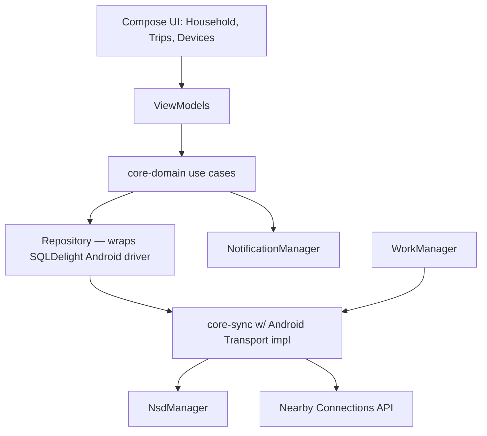

# Component Layout

Every write from the UI goes: UI → ViewModel → use case → repository →
local write, full stop. The Sync Engine is not in the write path — it only
reads the operation log to find operations to send out, and writes
incoming operations from peers. This means the app is 100% functional with
zero connectivity; sync is purely an eventually-arriving side effect (see
[Arch/04-android-app-architecture.md](../../Arch/04-android-app-architecture.md#offline-first-by-construction)).
