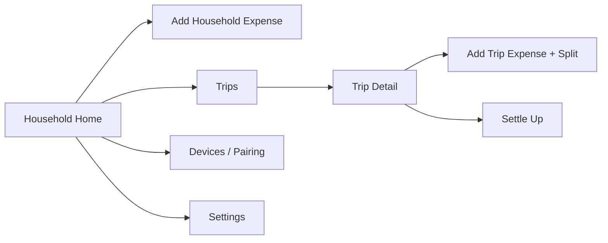

# Navigation & Screens

## Navigation graph

Single-Activity, Compose Navigation. Household Home is the start
destination (most frequent action: log an expense).

## Screens

- **Household Home** — current week's budget status banner (color per
  `BudgetStatus`: green `OK`, amber `NEARING`, red `OVER`, see
  [Design/Core/05-domain-logic.md](../Core/05-domain-logic.md#budget-status-evaluation)),
  recent expenses list, FAB to add an expense. Pull-to-refresh triggers a
  manual sync attempt against any currently-discoverable peer.
- **Add Household Expense** — amount, category, payer (defaults to self),
  date (defaults to now, editable for back-dating), note. On save: calls
  `RecordHouseholdExpense` use case, immediately re-evaluates
  `BudgetEvaluation` for the affected week and shows the resulting
  status/red-highlight inline before navigating back (no need to wait for
  the Home screen to reload).
- **Trips** — list of trips (open first, then closed), each row showing
  name, date range, and a small budget-status indicator (reusing the same
  `BudgetEvaluation` component as Household Home, since both are the same
  `core-domain` type).
- **Trip Detail** — participants, expense list, per-participant running
  balance, overall trip budget status banner. FAB to add an expense,
  button to Settle Up.
- **Add Trip Expense + Split** — amount, payer, category (optional),
  split mode selector (Equal / Exact / Percentage / Shares) with live
  validation matching [Design/Core/05-domain-logic.md](../Core/05-domain-logic.md#split-validation)
  (e.g. exact amounts must sum to total before Save is enabled).
- **Settle Up** — shows the simplified-debt suggestions
  ([Design/Core/05-domain-logic.md](../Core/05-domain-logic.md#trip-settlement-debt-simplification));
  tapping one records a `Settlement` (does not move real money — this is a
  bookkeeping confirmation, same as Splitwise).
- **Devices / Pairing** — list of paired devices with last-synced time;
  "Add a device" flow: show-my-QR / scan-their-QR two-step exchange per
  [Design/Core/04-pairing-and-crypto.md](../Core/04-pairing-and-crypto.md),
  using CameraX + ML Kit barcode scanning.
- **Settings** — currency, category management, notification toggle.
