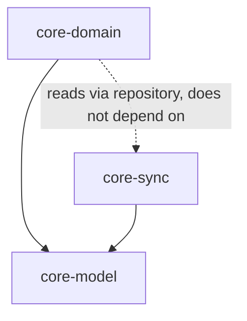

# Module Boundaries

- **`core-model`** — entities, the operation log record shape, HLC. No I/O,
  no coroutines even where avoidable. Pure data + pure functions.
- **`core-sync`** — the sync protocol from
  [Arch/03-sync-protocol.md](../../Arch/03-sync-protocol.md): frontier
  computation, session state machine, conflict resolution, pairing/crypto.
  Depends on `core-model`. Defines `Transport` and `OperationStore` as
  interfaces implemented per platform — `core-sync` itself never touches a
  socket or a database directly.
- **`core-domain`** — use cases: recording expenses, computing splits,
  weekly budget derivation, threshold/alerting evaluation, debt
  simplification. Depends on `core-model` and a `Repository` interface (not
  on `core-sync` directly — domain code shouldn't need to know sync exists).

Each platform app provides the concrete `Transport`, `OperationStore`, and
`Repository` implementations and wires the three modules together (see
[Design/Windows](../Windows/00-README.md) and
[Design/Android](../Android/00-README.md)).

## Why split into three instead of one

- `core-model` has zero dependencies and changes rarely — safe for both
  platform apps to depend on directly without pulling in sync or domain
  logic they might not need yet (e.g., a future read-only reporting tool).
- `core-sync` is the highest-risk, most-tested module and benefits from
  being independently versioned/tested without recompiling domain logic on
  every change.
- `core-domain` deliberately doesn't depend on `core-sync` so that domain
  rules (what counts as a valid split, how a week's budget is derived) can
  be reasoned about and unit-tested without any notion of networking or
  devices existing at all.
