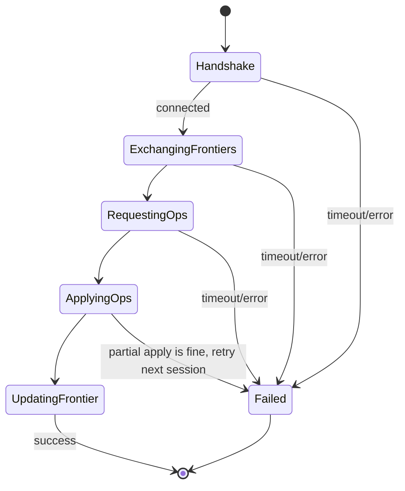

# Sync Protocol (`core-sync`)

## Interfaces the platform must implement

```kotlin
interface OperationStore {
    suspend fun append(ops: List<Operation>)          // idempotent by opId
    suspend fun opsSince(frontier: Map<String, Hlc>): List<Operation>
    suspend fun localFrontier(): Map<String, Hlc>      // per-device max hlc seen
}

interface Transport {
    fun advertise(deviceId: String)                    // start being discoverable
    fun discover(): Flow<PeerHandle>                    // peers found over time
    suspend fun connect(peer: PeerHandle): SyncChannel   // bidirectional byte stream
}

interface SyncChannel {
    suspend fun send(bytes: ByteArray)
    suspend fun receive(): ByteArray
    suspend fun close()
}
```

`core-sync` never imports Android or JVM-specific APIs — it only calls
these three interfaces, so the identical session/merge/gossip logic runs on
both platforms (see [Arch/06-tech-stack.md](../../Arch/06-tech-stack.md#what-this-buys-concretely)
for why that matters). Platform implementations are described in
[Design/Windows/02-transport-implementation.md](../Windows/02-transport-implementation.md)
and [Design/Android/02-transport-and-permissions.md](../Android/02-transport-and-permissions.md).

## Session state machine



Wire messages (all length-prefixed, `kotlinx.serialization` CBOR for
compactness over LAN/Bluetooth):

| Message | Direction | Payload |
|---|---|---|
| `Hello` | both | `deviceId`, protocol version, household id |
| `Frontier` | both | `Map<deviceId, Hlc>` |
| `OpsRequest` | both | `Map<deviceId, Hlc>` (what the sender needs, computed from the peer's frontier) |
| `OpsBatch` | both | `List<Operation>`, paged (e.g. 500 ops/message) so large first-syncs are resumable |
| `Ack` | both | last `opId` durably applied, so a dropped connection mid-batch resumes correctly |

Every message after `Hello` is per-direction and independent — both sides
push and pull in the same session (no separate "client"/"server" role
between two peers; symmetric, matching the mesh topology in
[Arch/03-sync-protocol.md](../../Arch/03-sync-protocol.md)).

## Conflict resolution (implementation of the Arch rule)

`core-sync` folds operations into a "current state" map per entity by:
1. Grouping applicable operations for an entity by `entityId`.
2. Sorting by `Hlc`.
3. For `CREATE`: first one wins as the base row (should be unique in
   practice; if two devices independently create the same `entityId`
   that's a bug elsewhere, not a sync concern — IDs are generated
   client-side as UUIDs specifically to make collisions practically
   impossible).
4. For `UPDATE`: apply patches to the base row in `Hlc` order, per-field —
   a later patch's field values overwrite earlier ones for the *same* key
   only.
5. For `DELETE`: once seen, the entity is a tombstone regardless of
   `Hlc` order of arrival (a delete always wins over any concurrent
   update, since resurrecting a user-deleted row is worse than losing an
   edit — documented tradeoff).
