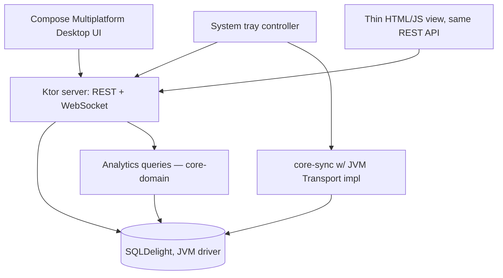

# Component Layout

The Windows app is a peer in the sync mesh (via `core-sync`) plus a REST/
WebSocket API layer that both the native Compose UI and the thin web view
consume identically — neither UI talks to the database directly, which
keeps the two front ends genuinely interchangeable and means all
sync-awareness lives in one place (the API layer and below), not in either
UI.
