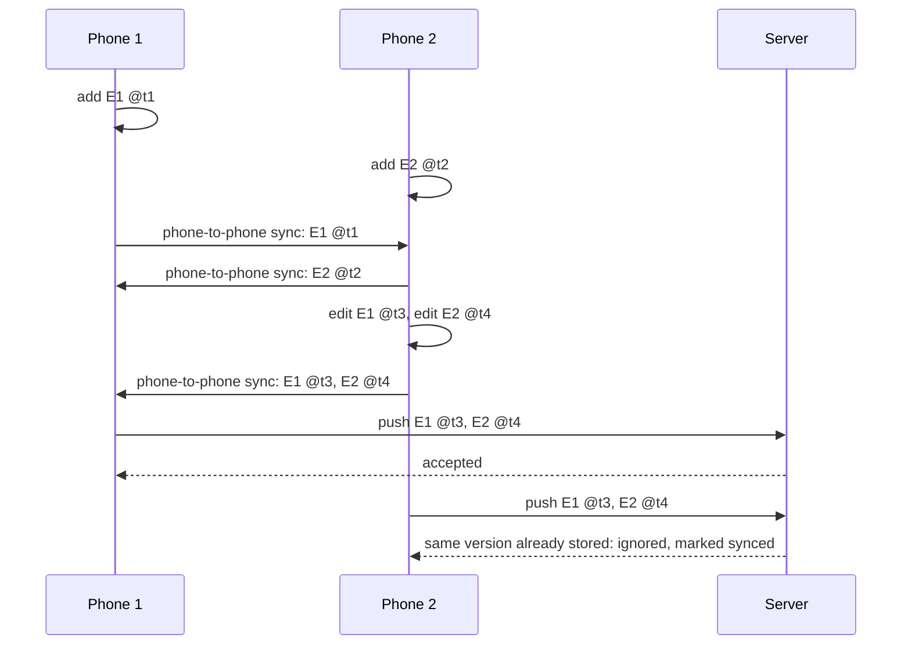

# Sync corner cases

Every case we know of where two devices, the server, or time can disagree,
and what record sync does about it. For each one: what happens, what should
happen, and whether it's handled, a gap to fix, or a decision to make.

This covers the record sync on PR #20 (`Implementation/Core/api`,
`Implementation/Windows/.../db/SyncStore.kt`,
`Implementation/Android/.../data/SyncLocalStore.kt`). Phone-to-phone sync
(V2) isn't built yet; cases that involve it assume it uses the same records
and rules as phone-to-server sync, which is the plan.

## How sync works today

1. **One id per record.** The device that creates a record picks its id;
   every phone and the server use that same id.
2. **Every change is stamped** with a Hybrid Logical Clock: time in
   milliseconds, a counter, and the device id.
3. **The later stamp wins**, for the whole record. An expense and its
   "who's it for" / "who chipped in" lines count as one record.
4. **Deletes leave a marker** (tombstone) instead of removing the record.
5. **Each record on a phone is pending or synced.** Sync pushes only
   pending records, then pulls everything the server wrote since the
   phone's cursor (the server's write sequence number, not a stamp).
6. A record is marked synced only if it wasn't edited again while the
   push was in flight.

## Status key

| Status | Meaning |
|---|---|
| **Handled** | Works correctly today; needs a test to keep it that way. |
| **Gap** | A real problem; a fix is proposed. |
| **Decision** | Correct behavior depends on a product choice — see [Open decisions](#open-decisions). |

## Summary

| ID | Case | Status |
|---|---|---|
| S1 | Same record reaches the server by two routes | Handled (with S14 fixed) |
| S2 | A phone retries a push after a timeout | Handled |
| S3 | Same category / subcategory / dependent created on two phones | Gap |
| S4 | Same person added twice by name | Decided — match on name + age + email + mobile |
| S5 | Two budget overrides for the same month | Gap |
| S6 | Rejoining after a reinstall | Handled |
| S7 | Two people edit the same expense offline | Decided — field-by-field merge |
| S8 | Delete, then someone else edits later | Decided — only the owner (or Windows) edits/deletes |
| S9 | Edit, then someone else deletes later | Handled |
| S10 | An old edit arrives late from an offline phone | Handled |
| S11 | A phone's clock is wrong | Gap (partly handled) |
| S12 | An edit made while a push is in flight | Handled |
| S13 | A pull arrives while the phone has a newer unsent edit | Handled |
| S14 | "Synced" means server-confirmed, not "a peer has it" | Gap (needed for V2) |
| S15 | A phone is lost or reset before syncing | Gap (needs S14) |
| S16 | Server off for days | Handled |
| S17 | Connection drops during a push | Handled |
| S18 | App killed halfway through applying a pull | Handled |
| S19 | A record arrives before the record it refers to | Handled (needs a test) |
| S20 | Server database restored from an old backup | Gap |
| S21 | Phone removed from the server and paired again | Handled |
| S22 | One phone paired to two Windows servers | Gap (out of scope for now) |
| S23 | The same debt settled twice on two phones | Gap |
| S24 | An expense edited after it was settled | Decided — label "changed after settling" |
| S25 | Member removed while another phone adds expenses for them | Handled |
| S26 | Household currency changed after expenses exist | Gap (low priority) |
| S27 | Renamed on the phone and on Windows at the same time | Handled |
| S28 | Rows from before stamps existed | Handled |
| S29 | Two phones end up with the same device id | Gap |
| S30 | A phone still on v0.1.2 talks to the new server | Gap |

---

## Identity and duplicates

### S1 — Same record reaches the server by two routes
**Scenario** (from review): phone 1 adds expense E1, phone 2 adds E2, the
phones sync with each other, phone 2 edits both, they sync again, then both
reach the server.

**Result:** one copy of each expense on the server, with phone 2's edits.
The ids never change, so the second push is recognized as the same version.
If phone 1 missed the second phone-to-phone sync, its push of E1 @t1 is
rejected as older and its next pull brings E1 @t3.

**Status:** Handled, *provided S14 is fixed*: without it, the copies
received in the phone-to-phone sync count as synced and would never be
pushed by the phone that received them.
**Test:** simulator scenario `twoPhonesThenServer` in both arrival orders,
plus the variant where phone 1 misses the second phone-to-phone sync.
The server half is covered today by `SyncStoreTest.sameRecordFromTwoPhonesIsStoredOnce`.

### S2 — A phone retries a push after a timeout
The server applied the push but the phone never got the reply, so the phone
pushes again. The second push carries the same versions; the server ignores
them and the phone marks them synced.
**Status:** Handled. **Test:** server — push the same batch twice and check
nothing changes; simulator — drop the reply on the first push.

### S3 — Same category / subcategory / dependent created on two phones
Both phones add a "Groceries" category (or a "Bruno (pet)" dependent)
before syncing. Each gets its own random id, so after sync the household has
two "Groceries", and expenses are split between them.
**Status:** Gap.
**Proposed fix:** for things identified by their name, derive the id from
the household and the normalized name (lower-case, trimmed), e.g. a hash.
Both phones then produce the same id and the two simply merge. Renaming
keeps the original id.
**Test:** two phones create the same name offline → one record after sync;
different capitalization → still one.

### S4 — Same person added twice by name
Two phones both add "Ravi" as an activity participant (participants can be
typed in when creating an activity). With random ids that's two Ravis.
Unlike categories, two different people can genuinely share a name, so
merging by name could be wrong.
**Decided:** a person is identified by **name + age + email + mobile**, not
by name alone. Two records whose four fields all match are the same person
and merge automatically. Typed-in guests (only a name, no app) are never
merged automatically; a user can merge them by hand in the activity's
settings. Joining by QR still matches by device id first; the server's
name-only fallback in `AddMember` is removed. Members and participants need
to carry age, email and mobile for this.

### S5 — Two budget overrides for the same month
The server allows one override per household per month. A second override
for the same month with a different id replaces the first regardless of
which is newer. Only the Windows app creates overrides today, but a phone
could later.
**Status:** Gap. **Proposed fix:** derive the override's id from the
household, year and month, so the same month is always the same record and
the normal "later wins" rule applies.

### S6 — Rejoining after a reinstall
A reinstalled phone has a new device id, so the server matches the person
by name plus email or phone (households) or by name (activities), and
reuses their existing member/participant. A phone that was never
reinstalled is matched by device id even after a rename.
**Status:** Handled. **Test:** exists in Core for members; add one for
participants matched by device id after a rename.

## Conflicting changes

### S7 — Two people edit the same expense offline
Phone A changes the amount, phone B changes the note, both offline. The
later edit replaces the whole expense, so the other change is lost without
anyone being told. This is the "last update wins" rule as agreed.
**Decided:** merge **field by field**, for every shared record (household
and activity settings, categories, subcategories, members, dependents,
budgets, expenses). Each field carries its own stamp; two changes to
different fields both survive, and only a field changed on both sides uses
the later change. With the S8 ownership rule, two people can no longer edit
the same expense, so for expenses this mostly applies to the owner vs the
Windows app.

### S8 — Delete, then someone else edits later
Phone A deletes an expense at 10:00; phone B, offline, edits it at 10:05.
Under strict "later wins", the edit brings the expense back. The original
design doc said a delete always wins.
**Decided:** avoided at the source by **ownership**. Only the person who
added an expense can edit or delete it — the person (member/participant),
not the phone, so it survives a reinstall or a new phone. The Windows app
can edit or delete any expense. If Windows and the owner change the same
expense before either has synced, **Windows' version wins**; an edit the
owner makes after receiving Windows' change applies normally. Phones hide
Edit/Delete on other people's expenses, and the server rejects a push that
changes an expense the pushing person doesn't own.

### S9 — Edit, then someone else deletes later
The delete is later, so it wins and the expense stays deleted.
**Status:** Handled. **Test:** server — covered by
`SyncStoreTest.deletesTravelAsTombstonesAndHideFromTheApp`; add the phone
side.

### S10 — An old edit arrives late from an offline phone
A phone offline for a week pushes an edit stamped last week; the record has
been edited since. The server keeps the newer version and rejects the old
one, and the phone pulls the newer version. Other phones still receive
everything because pulls use the server's write order, not stamps.
**Status:** Handled. **Test:** `SyncStoreTest.laterEditWinsOlderOneLoses`
and `pullReturnsOnlyWhatChangedSinceTheCursorIncludingLatePushes`.

### S11 — A phone's clock is wrong
The hybrid clock guarantees that a change made *after seeing* another
change always wins over it, whatever the clocks say. It does **not** stop a
phone whose clock runs ahead from winning genuinely simultaneous conflicts:
a phone set two days fast wins every concurrent edit for two days. (This
corrects an earlier claim that a wrong clock can't win conflicts it
shouldn't — it can, for concurrent edits.)
**Status:** Gap, partly handled.
**Proposed fix:** the server rejects stamps more than **5 minutes** ahead
of its own clock and tells the phone its clock is wrong; the phone shows a
warning and restamps. Phones' clocks are normally network-synced, so this
should be rare.
**Test:** a phone with a clock 2 days ahead pushes → rejected with a clear
message; a phone 2 minutes ahead → accepted.

### S12 — An edit made while a push is in flight
The push sends version 1; the user saves version 2 before the reply comes.
The phone marks the record synced only if it still holds version 1, so
version 2 stays pending and goes out next time.
**Status:** Handled. **Test:** simulator — edit between push and reply.

### S13 — A pull arrives while the phone has a newer unsent edit
The phone keeps its newer edit (the server's copy is older) and pushes it
on the next sync.
**Status:** Handled. **Test:** simulator.

## Getting changes to the server

### S14 — "Synced" means server-confirmed, not "a peer has it"
Today a record received during a sync is marked synced. That's right while
the server is the only thing a phone syncs with. With phone-to-phone sync,
a record received from another phone would count as synced although the
server has never seen it — so the receiving phone would never upload it.
**Status:** Gap — must be fixed before V2; cheapest now, while database
version 9 is still unreleased.
**Proposed fix:** each record stores the last stamp the server confirmed.
"Pending" means "current stamp differs from the server-confirmed one". A
record received from another phone keeps its pending state; only a server
reply or a server pull marks it confirmed.
**Test:** simulator — after phone-to-phone sync, both phones hold both
records as pending; after one phone syncs with the server, that phone's
copies become confirmed and the other phone's stay pending until it syncs.

### S15 — A phone is lost or reset before syncing
Anything only on that phone is gone; nothing can recover data no other
device has seen. With S14 fixed, anything it already shared with another
phone still reaches the server through that phone.
**Status:** Gap (needs S14); otherwise inherent.

### S16 — Server off for days
Phones keep working; everything stays pending and goes up when the server
is back.
**Status:** Handled. **Test:** simulator — 50 changes offline, then one sync.

### S17 — Connection drops during a push
The server applies each record in turn. If the connection drops before the
reply, the phone marks nothing synced and pushes again later; records the
server already applied are recognized as the same version.
**Status:** Handled. **Test:** server — apply half a batch, then the whole
batch → each record stored once.

### S18 — App killed halfway through applying a pull
The phone saves its cursor only after applying the whole pull, so the next
sync pulls the same records again; applying them twice changes nothing.
**Status:** Handled. **Test:** simulator — stop after half the records,
resume.

### S19 — A record arrives before the record it refers to
For example an expense in a category the receiving phone hasn't seen yet.
Each side sends parents first, so it shouldn't happen within one sync, but
it can across phones. The expense is stored pointing at the category's id;
until the category arrives, it shows without a category name. Neither side
enforces links, so nothing breaks.
**Status:** Handled (needs a test).

### S20 — Server database restored from an old backup
The server's write sequence goes backwards. Phones' cursors are now ahead
of it, so changes the server writes afterwards with lower numbers are never
pulled, and records the phones marked synced after the backup are missing
on the server.
**Status:** Gap.
**Proposed fix:** the server keeps a random "database id" that changes
when the database is restored or replaced (e.g. created fresh and stored in
the data folder). Pulls return it; when it differs from what the phone
last saw, the phone resets its cursor and marks everything pending again,
so the server is rebuilt from the phones.
**Test:** server — restore → database id changes; simulator — phone sees a
new id → full re-sync, nothing lost.

### S21 — Phone removed from the server and paired again
Pending records stay pending; the cursor is kept and still valid; sync
resumes after pairing.
**Status:** Handled.

### S22 — One phone paired to two Windows servers
A household belongs to the first server it was linked to; the other server
never sees it. Two independent Windows servers for one household isn't a
supported setup.
**Status:** Gap, out of scope for now — note in the README if it matters.

## Money

### S23 — The same debt settled twice on two phones
Both people tap Settle for the same ₹500 before syncing. Two payments are
recorded (different ids, so "later wins" doesn't apply) and the balance
flips: the creditor now owes ₹500.
**Status:** Gap.
**Proposed fix:** (1) list recorded settlements on the household/activity
screen with Undo, which deletes the settlement like any record — **only the
person who recorded it, or the Windows app, can undo it** (same ownership
rule as expenses); (2) after a
pull, if a settlement from another device covers the same pair of people
within a day of one made here, show "This payment may have been recorded
twice — undo one?".
**Test:** simulator — both settle offline → after sync the duplicate is
detected; undo one → balances back to zero.

### S24 — An expense edited after it was settled
A ₹1,000 dinner is settled, then someone corrects it to ₹800. The
settlement now overpays and the suggestion reverses. The arithmetic is
correct, but users may be confused.
**Decided:** keep the correct arithmetic, and label the edited expense and
the reversed suggestion "changed after settling" so people can see why the
balance moved.

### S25 — Member removed while another phone adds expenses for them
Removing a member archives them (keeps the id), so expenses added for them
elsewhere still resolve and still count in balances.
**Status:** Handled. **Test:** simulator.

### S26 — Household currency changed after expenses exist
Each expense keeps its own currency, but budget and balance totals add
amounts without converting. Changing a household from INR to USD would mix
currencies in totals.
**Status:** Gap, low priority (all current use is INR). **Proposed fix:**
don't allow changing the currency once expenses exist, or ask for an
exchange rate.

## Identity of "me"

### S27 — Renamed on the phone and on Windows at the same time
Both edits are stamped; the later one wins, on every device.
**Status:** Handled. **Test:** `SyncStoreTest.renameReachesTheServerAndKeepsTheSameMember`
covers the phone rename; add the concurrent case.

### S28 — Rows from before stamps existed
Rows written by the old versions have no stamp, which counts as the oldest
possible. Any real edit wins over them, and a phone with an unedited
pre-stamp row takes the server's copy (equal stamps on an unedited row
mean "use the server's").
**Status:** Handled. **Test:** `MigrationTest`, plus the phone-side rule.

### S29 — Two phones end up with the same device id
Android's automatic backup is on (`allowBackup="true"`, no exclusion
rules), so the app's database — including the profile and its device id —
can be restored onto a new phone while the old one is still in use. Both
then stamp as the same device: two different versions can carry the
identical stamp and phones would disagree about which is current, and the
server would treat both phones as one member.
**Status:** Gap.
**Proposed fix:** exclude the profile's device id from backup (or detect a
restore and generate a new device id), and treat the restored phone as a
rejoin (S6).

### S30 — A phone still on v0.1.2 talks to the new server
The old REST routes still exist because the Windows app's own screens use
them, so an old phone keeps "syncing" through them with the old rules:
server-assigned ids and server-wins. That half-works rather than failing
clearly, which is worse. (This corrects an earlier claim that old phones
simply can't sync.)
**Status:** Gap.
**Proposed fix:** phones send their app version; the server rejects
pre-record-sync versions on the sync-related routes with "Update Kharcha to
keep syncing", which the old app already shows as a sync error.

---

## Decisions (2026-10-10)

| # | Question | Decision |
|---|---|---|
| S4 | Same person added twice | Same person only if name + age + email + mobile all match → merge automatically. Guests never auto-merge; merge by hand. |
| S7 | Two edits to the same record | Field-by-field merge, for every shared record type. |
| S8 | Delete vs a later edit | Only the expense's owner (the person) or the Windows app can edit/delete it. Windows wins a clash; later edits by the owner apply normally. |
| S24 | Expense changed after settling | Label it "changed after settling". |
| S23 | Who can undo a settlement | The person who recorded it, or the Windows app. |
| S11 | Clock limit | Reject stamps more than 5 minutes ahead of the server. |

Fixes approved for the next sync PR: sync safety (S14, S20, S29, S30),
duplicates (S3, S5), money (S23, S24) and the clock check (S11).

## How these get tested

1. **Move the merge rules into Core.** The "apply incoming record",
   "what's pending" and "what's confirmed" rules become plain functions in
   `Implementation/Core`, used by Android, the server and future
   phone-to-phone sync — one copy to test.
2. **Multi-device simulator** in Core tests: several simulated phones and a
   server, with steps like add, edit, delete, settle, phone-to-phone sync,
   push, pull, drop the reply, kill mid-pull, lose a phone, restore the
   server. Each case above gets a named scenario.
3. **Randomized runs**: generate thousands of random step sequences and
   check after a final full sync that
   - every device matches the server,
   - nothing is duplicated (S1, S3),
   - the newest version of every record won,
   - nothing a server had confirmed was lost.
4. **Server tests** (`Implementation/Windows/app/src/test`) for the
   server-only cases: S2, S5, S11, S17, S20, S30.
5. **Real-device checklist** for the batch test: pair two phones and the
   Windows app, then walk S1, S7–S9, S16, S23 and S27 by hand.
